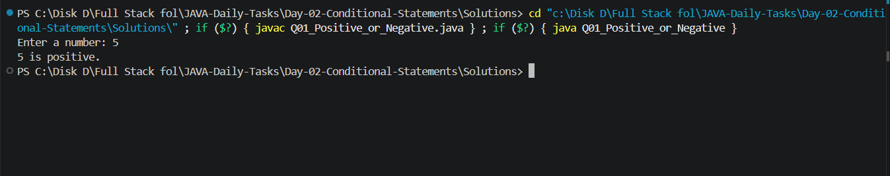
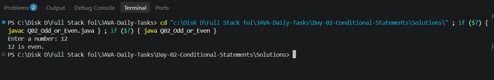
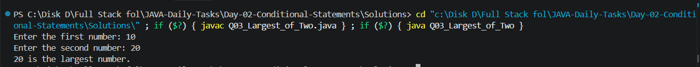
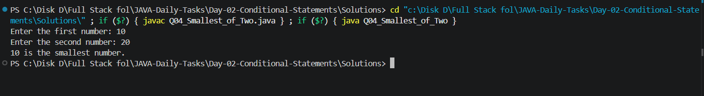
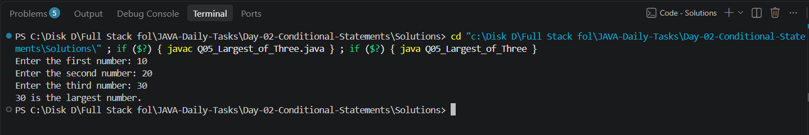
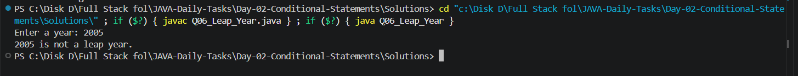
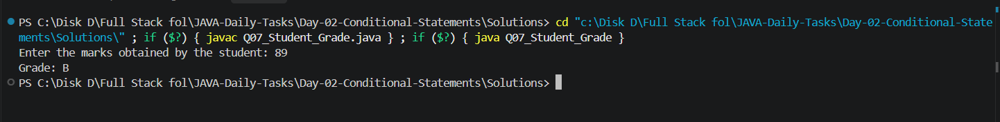
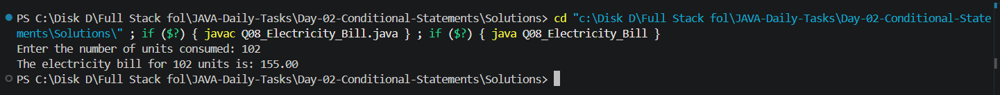
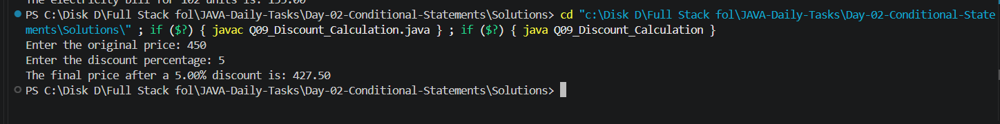
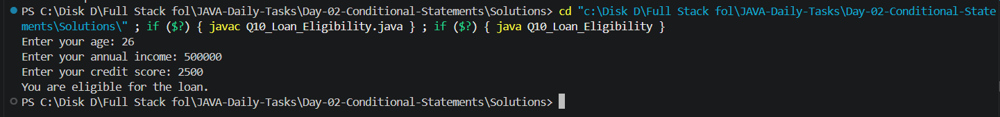

# 📘 Day 02 - Conditional Statements

This folder contains my **Day 02 Java practice tasks** focused on **conditional statements and decision-making**.

The goal of this day is to understand how Java makes decisions based on different conditions and apply those concepts to simple programming and real-world problems.

---

## 📚 Topics Covered

* `if` statement
* `if-else` statement
* `else-if` statement
* Comparison operators
* Logical operators
* Modulus operator `%`
* User input using `Scanner`
* Decision-making in Java
* Real-world conditional problems

---

## 📁 Folder Structure

```text
Day-02-Conditional-Statements/
│
├── README.md
│
├── Questions/
│   └── Questions.txt
│
├── Solutions/
│   ├── Q01_Positive_or_Negative.java
│   ├── Q02_Odd_or_Even.java
│   ├── Q03_Largest_of_Two.java
│   ├── Q04_Smallest_of_Two.java
│   ├── Q05_Largest_of_Three.java
│   ├── Q06_Leap_Year.java
│   ├── Q07_Student_Grade.java
│   ├── Q08_Electricity_Bill.java
│   ├── Q09_Discount_Calculation.java
│   └── Q10_Loan_Eligibility.java
│
└── Screenshots/
    ├── Output_1.png
    ├── Output_2.png
    ├── Output_3.png
    ├── Output_4.png
    ├── Output_5.png
    ├── Output_6.png
    ├── Output_7.png
    ├── Output_8.png
    ├── Output_9.png
    └── Output_10.png
```

---

## 📝 Practice Questions

| No. | Problem                  | Main Concept            |
| --- | ------------------------ | ----------------------- |
| Q01 | Positive or Negative     | `if-else`               |
| Q02 | Odd or Even              | Modulus `%`             |
| Q03 | Largest of Two Numbers   | `if-else`               |
| Q04 | Smallest of Two Numbers  | `if-else`               |
| Q05 | Largest of Three Numbers | `else-if`               |
| Q06 | Leap Year                | Conditions + `%`        |
| Q07 | Student Grade            | `else-if`               |
| Q08 | Electricity Bill         | Real-world conditions   |
| Q09 | Discount Calculation     | Conditions + percentage |
| Q10 | Loan Eligibility         | Logical `&&`            |

---

## 💻 Solutions

### Q01 - Positive or Negative

Checks whether a given number is **positive, negative, or zero**.

**Concepts used:**

* `if-else`
* Comparison operators
* `Scanner`

---

### Q02 - Odd or Even

Checks whether a number is **odd or even** using the modulus operator.

**Concepts used:**

* Modulus `%`
* `if-else`
* User input

---

### Q03 - Largest of Two Numbers

Finds the **largest value between two numbers**.

**Concepts used:**

* `if-else`
* Comparison operators

---

### Q04 - Smallest of Two Numbers

Finds the **smallest value between two numbers**.

**Concepts used:**

* `if-else`
* Comparison operators

---

### Q05 - Largest of Three Numbers

Finds the **largest value among three numbers**.

**Concepts used:**

* `if`
* `else-if`
* `else`
* Comparison operators

---

### Q06 - Leap Year

Checks whether a given year is a **leap year**.

**Concepts used:**

* Conditional statements
* Logical operators
* Modulus `%`

---

### Q07 - Student Grade

Calculates a student's **grade based on their marks**.

**Concepts used:**

* `else-if`
* Comparison operators
* Multiple conditions

---

### Q08 - Electricity Bill

Calculates an **electricity bill based on the number of units consumed** and adds a surcharge.

**Concepts used:**

* Conditional statements
* Multiple conditions
* Arithmetic operators
* Real-world problem solving

---

### Q09 - Discount Calculation

Calculates the **discount amount and final purchase amount** based on the purchase value.

**Concepts used:**

* Conditional statements
* Percentage calculation
* Arithmetic operators

---

### Q10 - Loan Eligibility

Checks whether a person is **eligible for a loan** based on their age and monthly salary.

**Concepts used:**

* Logical `&&` operator
* Comparison operators
* `if-else`

---

## 🖥️ Output Screenshots

### Q01 - Positive or Negative



---

### Q02 - Odd or Even



---

### Q03 - Largest of Two Numbers



---

### Q04 - Smallest of Two Numbers



---

### Q05 - Largest of Three Numbers



---

### Q06 - Leap Year



---

### Q07 - Student Grade



---

### Q08 - Electricity Bill



---

### Q09 - Discount Calculation



---

### Q10 - Loan Eligibility



---

## 🛠️ Technologies Used

* ☕ Java
* 💻 VS Code
* 🔧 JDK
* 🌿 Git
* 🐙 GitHub

---

## ▶️ How to Run

### Step 1 - Open the Solutions Folder

Open the terminal inside the `Solutions` folder.

```bash
cd Solutions
```

### Step 2 - Compile a Java Program

For example:

```bash
javac Q01_Positive_or_Negative.java
```

### Step 3 - Run the Program

```bash
java Q01_Positive_or_Negative
```

You can follow the same process for the remaining programs.

---

## ▶️ Compile All Programs

To compile all Java files inside the `Solutions` folder:

```bash
javac *.java
```

Then run any program individually:

```bash
java Q01_Positive_or_Negative
```

```bash
java Q02_Odd_or_Even
```

```bash
java Q03_Largest_of_Two
```

---

## 📸 Screenshots

The `Screenshots` folder contains the output screenshots for all 10 Java programs.

Each screenshot is linked to its corresponding practice question above to make it easy to understand the program execution and output.

---

## 🧠 What I Learned

Through Day 02, I practiced:

* Making decisions using `if`
* Handling alternative conditions using `if-else`
* Checking multiple conditions using `else-if`
* Comparing values
* Using logical operators
* Using the modulus operator `%`
* Taking user input using `Scanner`
* Applying arithmetic operations
* Solving simple real-world programming problems
* Improving logical thinking through Java conditions

---

## 🎯 Learning Goal

The main goal of **Day 02** is to build a strong foundation in **conditional statements and decision-making in Java**.

These concepts are important for solving programming problems and will be used in upcoming Java topics.

---

## 📈 Progress

| Day    | Topic                  | Status      |
| ------ | ---------------------- | ----------- |
| Day 02 | Conditional Statements | ✅ Completed |

> Learning Java step by step by practicing small problems every day.

---

## 👨‍💻 Author

**M. Praveen Kumar**

* GitHub: [PraveenKumar7545](https://github.com/PraveenKumar7545)
* Repository: [JAVA-Daily-Tasks](https://github.com/PraveenKumar7545/JAVA-Daily-Tasks)

---

⭐ This folder is part of my **Java Daily Tasks** journey to improve my Java programming and problem-solving skills.
