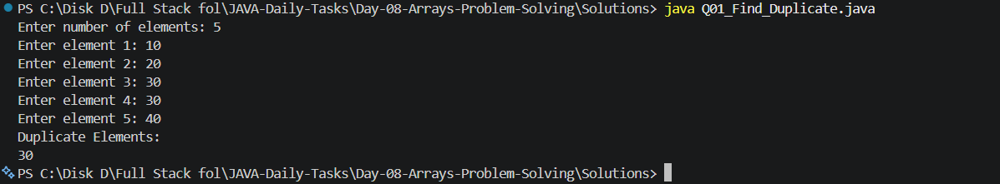
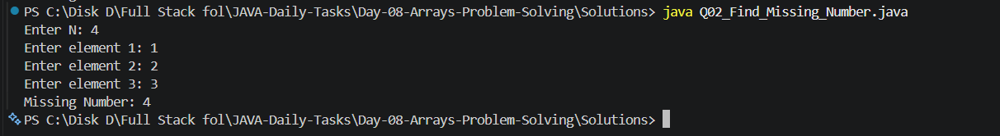
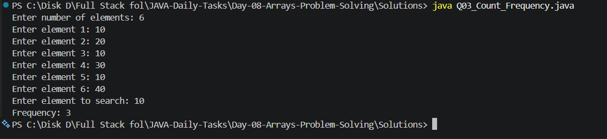
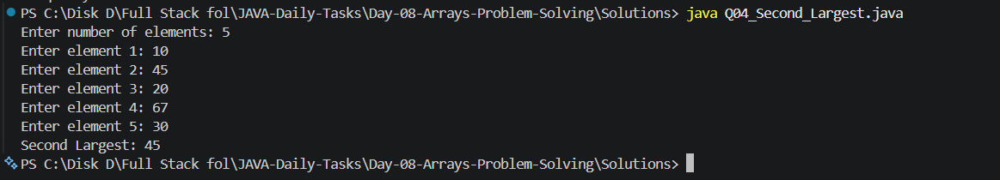
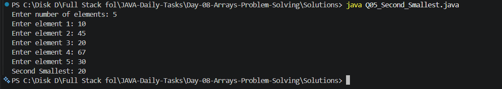
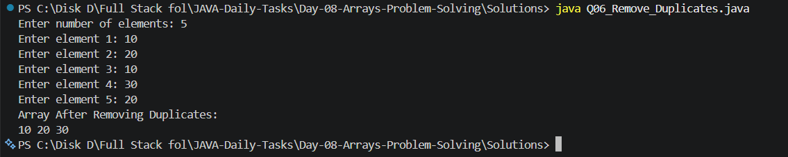
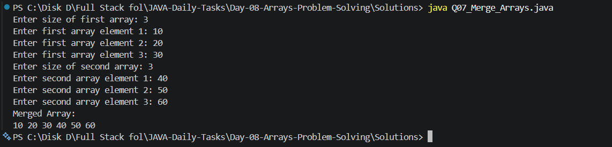
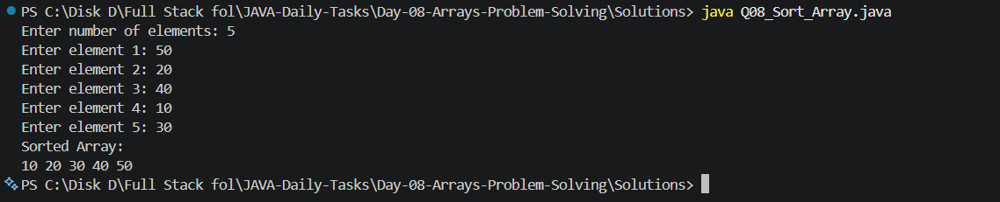
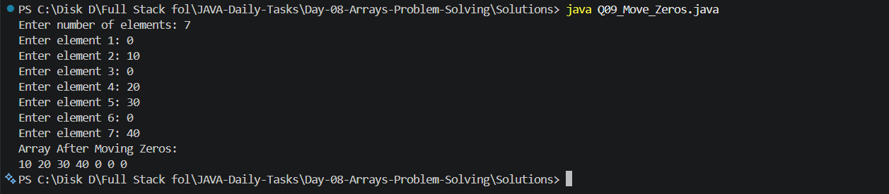
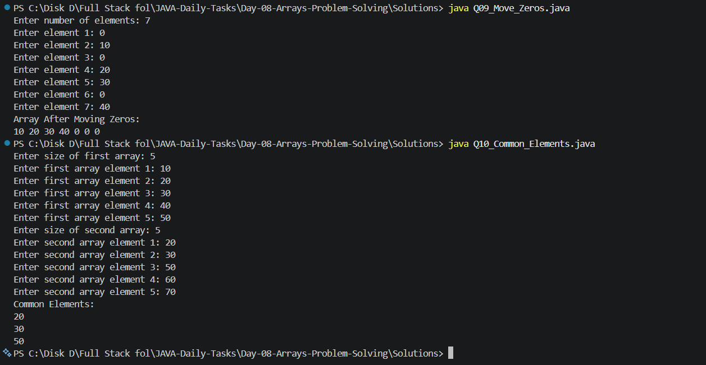

# Day 08 - Arrays Problem Solving

## 📌 Introduction

Day 08 of my **Java Daily Tasks** focuses on **Arrays Problem Solving**.

In Day 07, I learned the basic operations of arrays. In Day 08, I am applying arrays to solve more logical and problem-solving-based programs.

This day includes duplicate elements, missing numbers, frequency counting, second largest and smallest elements, removing duplicates, merging arrays, sorting, moving zeros, and finding common elements.

---

## 🎯 Objectives

The main objectives of Day 08 are:

* Improve array problem-solving skills
* Find duplicate elements
* Find missing numbers
* Count element frequency
* Find the second largest element
* Find the second smallest element
* Remove duplicate elements
* Merge two arrays
* Sort an array
* Move zeros to the end
* Find common elements between two arrays
* Improve logical thinking using arrays

---

## 📚 Topics Covered

* Arrays
* Array traversal
* Nested loops
* Duplicate detection
* Missing number logic
* Frequency counting
* Second largest element
* Second smallest element
* Removing duplicates
* Merging arrays
* Bubble Sort
* Moving zeros
* Common elements
* Linear searching

---

## 📁 Folder Structure

```text
Day-08-Arrays-Problem-Solving/
│
├── Questions/
│   └── Questions.txt
│
├── Screenshots/
│   ├── Output_1.png
│   ├── Output_2.png
│   ├── Output_3.png
│   ├── Output_4.png
│   ├── Output_5.png
│   ├── Output_6.png
│   ├── Output_7.png
│   ├── Output_8.png
│   ├── Output_9.png
│   └── Output_10.png
│
├── Solutions/
│   ├── Q01_Find_Duplicate.java
│   ├── Q02_Find_Missing_Number.java
│   ├── Q03_Count_Frequency.java
│   ├── Q04_Second_Largest.java
│   ├── Q05_Second_Smallest.java
│   ├── Q06_Remove_Duplicates.java
│   ├── Q07_Merge_Arrays.java
│   ├── Q08_Sort_Array.java
│   ├── Q09_Move_Zeros.java
│   └── Q10_Common_Elements.java
│
└── README.md
```

---

## 📝 Practice Questions

### Q01 - Find Duplicate

Find and print the duplicate elements present in an array.

### Q02 - Find Missing Number

Find the missing number from an array containing numbers from `1` to `n`.

### Q03 - Count Frequency

Count how many times each element occurs in an array.

### Q04 - Find Second Largest

Find the second largest element in an array.

### Q05 - Find Second Smallest

Find the second smallest element in an array.

### Q06 - Remove Duplicates

Remove duplicate elements from an array and display only unique elements.

### Q07 - Merge Two Arrays

Merge two arrays into a single array.

### Q08 - Sort an Array

Sort the elements of an array in ascending order.

### Q09 - Move Zeros

Move all zero elements to the end of the array while maintaining the order of non-zero elements.

### Q10 - Find Common Elements

Find the elements that are common between two arrays.

---

## 💻 Solutions

| No. | Problem             | Solution                       |
| --- | ------------------- | ------------------------------ |
| Q01 | Find Duplicate      | `Q01_Find_Duplicate.java`      |
| Q02 | Find Missing Number | `Q02_Find_Missing_Number.java` |
| Q03 | Count Frequency     | `Q03_Count_Frequency.java`     |
| Q04 | Second Largest      | `Q04_Second_Largest.java`      |
| Q05 | Second Smallest     | `Q05_Second_Smallest.java`     |
| Q06 | Remove Duplicates   | `Q06_Remove_Duplicates.java`   |
| Q07 | Merge Arrays        | `Q07_Merge_Arrays.java`        |
| Q08 | Sort Array          | `Q08_Sort_Array.java`          |
| Q09 | Move Zeros          | `Q09_Move_Zeros.java`          |
| Q10 | Common Elements     | `Q10_Common_Elements.java`     |

---

## 🖥️ Output Screenshots

### Q01 - Find Duplicate



---

### Q02 - Find Missing Number



---

### Q03 - Count Frequency



---

### Q04 - Find Second Largest



---

### Q05 - Find Second Smallest



---

### Q06 - Remove Duplicates



---

### Q07 - Merge Two Arrays



---

### Q08 - Sort an Array



---

### Q09 - Move Zeros



---

### Q10 - Find Common Elements



---

## 🛠️ Technologies Used

* **Java**
* **JDK**
* **VS Code**
* **Git**
* **GitHub**

---

## ▶️ How to Run

### Step 1 - Open the Day 08 folder

```bash
cd Day-08-Arrays-Problem-Solving
```

### Step 2 - Open the Solutions folder

```bash
cd Solutions
```

### Step 3 - Compile a Java program

Example:

```bash
javac Q01_Find_Duplicate.java
```

### Step 4 - Run the program

```bash
java Q01_Find_Duplicate
```

The same process can be followed for the remaining programs.

---

## 🧠 What I Learned

Through Day 08, I practiced:

* Working with arrays
* Traversing arrays using loops
* Using nested loops for comparisons
* Detecting duplicate values
* Finding missing values
* Counting element frequency
* Finding second largest and smallest values
* Removing duplicate elements
* Merging multiple arrays
* Sorting array elements
* Moving zeros to the end
* Comparing two arrays
* Improving logical thinking and problem-solving skills

---

## 🎯 Learning Goal

The goal of Day 08 is to build a strong foundation in **array-based problem solving** before moving toward more advanced Java topics such as:

* Strings
* Methods
* Object-Oriented Programming
* Collections
* Searching and Sorting Algorithms
* Data Structures
* DSA Problem Solving

---

## 📊 Progress

| Day    | Topic                  | Status      |
| ------ | ---------------------- | ----------- |
| Day 08 | Arrays Problem Solving | ✅ Completed |

---

## 👨‍💻 Author

**M. Praveen Kumar**

* GitHub: [PraveenKumar7545](https://github.com/PraveenKumar7545)
* Repository: [JAVA-Daily-Tasks](https://github.com/PraveenKumar7545/JAVA-Daily-Tasks)

---

⭐ This is part of my **Java Daily Tasks** journey to improve my Java programming and problem-solving skills.
