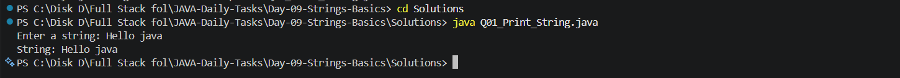
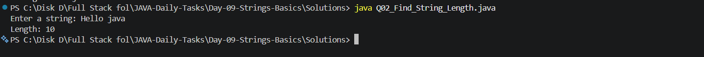
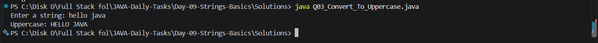
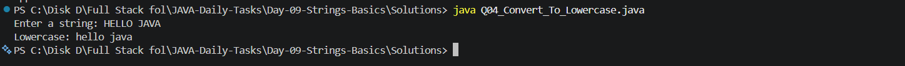
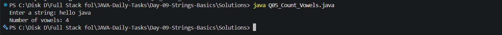
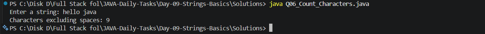
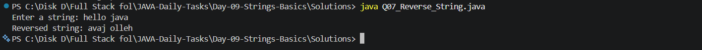
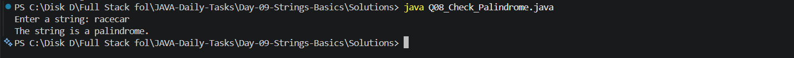
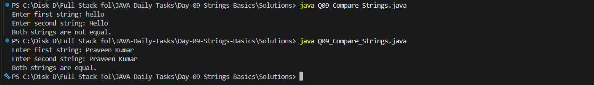
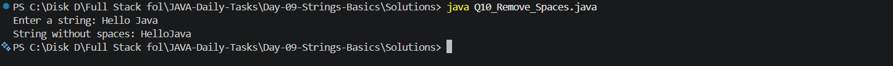

# 📘 Day 09 - Strings Basics

This folder contains my **Day 09 Java practice tasks** focused on **Strings and basic string manipulation**.

The goal of this day is to understand how strings work in Java and practice common operations used in programming and problem-solving.

---

## 📚 Topics Covered

* String creation

* String input

* `length()`

* `toUpperCase()`

* `toLowerCase()`

* `charAt()`

* `equals()`

* `equalsIgnoreCase()`

* String reversal

* Palindrome checking

* Counting characters

* Removing spaces

---

## 📂 Folder Structure

```text
Day-09-Strings-Basics

│
├── Questions
│   └── Questions.txt
│
├── Screenshots
│   ├── Output_1.png
│   ├── Output_2.png
│   ├── Output_3.png
│   ├── Output_4.png
│   ├── Output_5.png
│   ├── Output_6.png
│   ├── Output_7.png
│   ├── Output_8.png
│   ├── Output_9.png
│   └── Output_10.png
│
├── Solutions
│   ├── Q01_Print_String.java
│   ├── Q02_Find_String_Length.java
│   ├── Q03_Convert_To_Uppercase.java
│   ├── Q04_Convert_To_Lowercase.java
│   ├── Q05_Count_Vowels.java
│   ├── Q06_Count_Characters.java
│   ├── Q07_Reverse_String.java
│   ├── Q08_Check_Palindrome.java
│   ├── Q09_Compare_Strings.java
│   └── Q10_Remove_Spaces.java
│
└── README.md
```

---

## 🖥️ Output Screenshots

### Q01 - Print String



### Q02 - Find String Length



### Q03 - Convert To Uppercase



### Q04 - Convert To Lowercase



### Q05 - Count Vowels



### Q06 - Count Characters



### Q07 - Reverse String



### Q08 - Check Palindrome



### Q09 - Compare Strings



### Q10 - Remove Spaces



```
```
