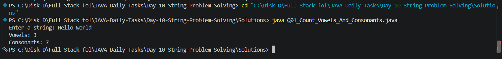
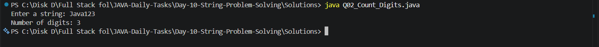
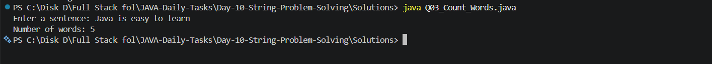
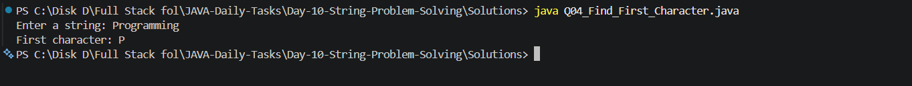
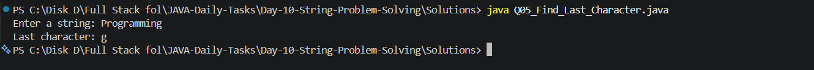
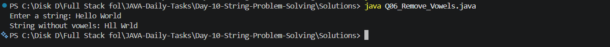
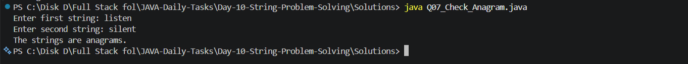
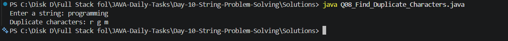
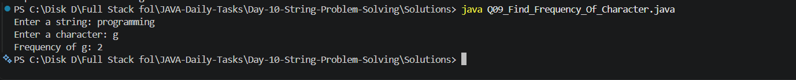
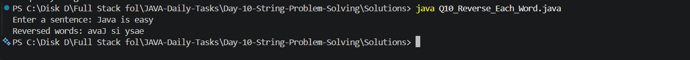

# Day 10 - String Problem Solving

## 📌 Introduction

Day 10 of my **Java Daily Tasks** focuses on **String Problem Solving**.

In Day 09, I learned the basic operations of strings. In Day 10, I am applying strings to solve more logical and problem-solving-based programs.

This day includes counting vowels and consonants, counting digits and words, finding characters, removing vowels, checking anagrams, finding duplicate characters, counting character frequency, and reversing each word.

---

## 🎯 Objectives

The main objectives of Day 10 are:

* Improve string problem-solving skills
* Count vowels and consonants
* Count digits in a string
* Count words in a sentence
* Find the first character
* Find the last character
* Remove vowels from a string
* Check whether two strings are anagrams
* Find duplicate characters
* Find character frequency
* Reverse each word in a sentence
* Improve logical thinking using strings

---

## 📚 Topics Covered

* Strings
* String traversal
* `charAt()`
* `length()`
* `toLowerCase()`
* `replace()`
* `split()`
* Character comparison
* Vowel and consonant checking
* Digit checking
* Word counting
* Anagram checking
* Duplicate character detection
* Frequency counting
* String reversal

---

## 📁 Folder Structure

```text
Day-10-String-Problem-Solving/
│
├── Questions/
│   └── Questions.txt
│
├── Screenshots/
│   ├── Output_1.png
│   ├── Output_2.png
│   ├── Output_3.png
│   ├── Output_4.png
│   ├── Output_5.png
│   ├── Output_6.png
│   ├── Output_7.png
│   ├── Output_8.png
│   ├── Output_9.png
│   └── Output_10.png
│
├── Solutions/
│   ├── Q01_Count_Vowels_And_Consonants.java
│   ├── Q02_Count_Digits.java
│   ├── Q03_Count_Words.java
│   ├── Q04_Find_First_Character.java
│   ├── Q05_Find_Last_Character.java
│   ├── Q06_Remove_Vowels.java
│   ├── Q07_Check_Anagram.java
│   ├── Q08_Find_Duplicate_Characters.java
│   ├── Q09_Find_Frequency_Of_Character.java
│   └── Q10_Reverse_Each_Word.java
│
└── README.md
```

---

## 📝 Practice Questions

### Q01 - Count Vowels and Consonants

Count the number of vowels and consonants present in a given string.

### Q02 - Count Digits

Count the number of digits present in a given string.

### Q03 - Count Words

Count the number of words present in a given sentence.

### Q04 - Find First Character

Find and print the first character of a given string.

### Q05 - Find Last Character

Find and print the last character of a given string.

### Q06 - Remove Vowels

Remove all vowels from a given string and display the remaining characters.

### Q07 - Check Anagram

Check whether two given strings are anagrams of each other.

### Q08 - Find Duplicate Characters

Find and print the duplicate characters present in a given string.

### Q09 - Find Character Frequency

Find how many times a given character occurs in a string.

### Q10 - Reverse Each Word

Reverse each word in a sentence without changing the order of the words.

---

## 💻 Solutions

| No. | Problem                     | Solution                               |
| --- | --------------------------- | -------------------------------------- |
| Q01 | Count Vowels and Consonants | `Q01_Count_Vowels_And_Consonants.java` |
| Q02 | Count Digits                | `Q02_Count_Digits.java`                |
| Q03 | Count Words                 | `Q03_Count_Words.java`                 |
| Q04 | Find First Character        | `Q04_Find_First_Character.java`        |
| Q05 | Find Last Character         | `Q05_Find_Last_Character.java`         |
| Q06 | Remove Vowels               | `Q06_Remove_Vowels.java`               |
| Q07 | Check Anagram               | `Q07_Check_Anagram.java`               |
| Q08 | Find Duplicate Characters   | `Q08_Find_Duplicate_Characters.java`   |
| Q09 | Find Character Frequency    | `Q09_Find_Frequency_Of_Character.java` |
| Q10 | Reverse Each Word           | `Q10_Reverse_Each_Word.java`           |

---

## 🖥️ Output Screenshots

### Q01 - Count Vowels and Consonants



---

### Q02 - Count Digits



---

### Q03 - Count Words



---

### Q04 - Find First Character



---

### Q05 - Find Last Character



---

### Q06 - Remove Vowels



---

### Q07 - Check Anagram



---

### Q08 - Find Duplicate Characters



---

### Q09 - Find Character Frequency



---

### Q10 - Reverse Each Word



---

## 🛠️ Technologies Used

* **Java**
* **JDK**
* **VS Code**
* **Git**
* **GitHub**

---

## ▶️ How to Run

### Step 1 - Open the Day 10 folder

```bash
cd Day-10-String-Problem-Solving
```

### Step 2 - Open the Solutions folder

```bash
cd Solutions
```

### Step 3 - Compile a Java program

Example:

```bash
javac Q01_Count_Vowels_And_Consonants.java
```

### Step 4 - Run the program

```bash
java Q01_Count_Vowels_And_Consonants
```

The same process can be followed for the remaining programs.

---

## 🧠 What I Learned

Through Day 10, I practiced:

* Working with strings
* Traversing strings using loops
* Accessing individual characters
* Counting vowels and consonants
* Counting digits
* Counting words
* Finding the first and last characters
* Removing vowels
* Checking whether strings are anagrams
* Finding duplicate characters
* Finding character frequency
* Reversing individual words
* Improving logical thinking and problem-solving skills

---

## 🎯 Learning Goal

The goal of Day 10 is to build a strong foundation in **string-based problem solving** before moving toward more advanced Java topics such as:

* Methods
* Object-Oriented Programming
* Collections
* Searching and Sorting Algorithms
* Data Structures
* DSA Problem Solving

---

## 📊 Progress

| Day    | Topic                  | Status      |
| ------ | ---------------------- | ----------- |
| Day 10 | String Problem Solving | ✅ Completed |

---

## 👨‍💻 Author

**M. Praveen Kumar**

* GitHub: [PraveenKumar7545](https://github.com/PraveenKumar7545)
* Repository: [JAVA-Daily-Tasks](https://github.com/PraveenKumar7545/JAVA-Daily-Tasks)

---

⭐ This is part of my **Java Daily Tasks** journey to improve my Java programming and problem-solving skills.
