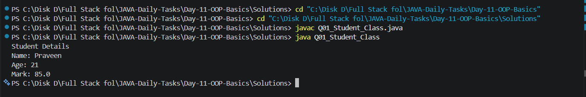
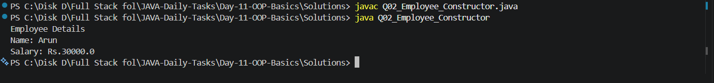
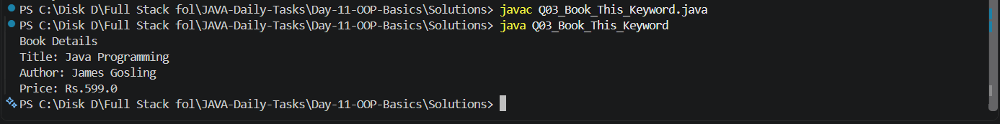
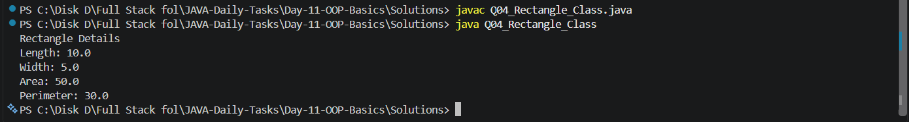
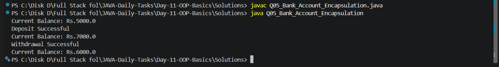
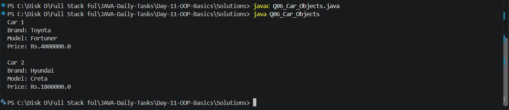
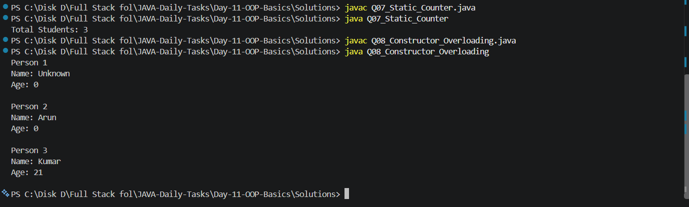
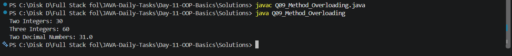
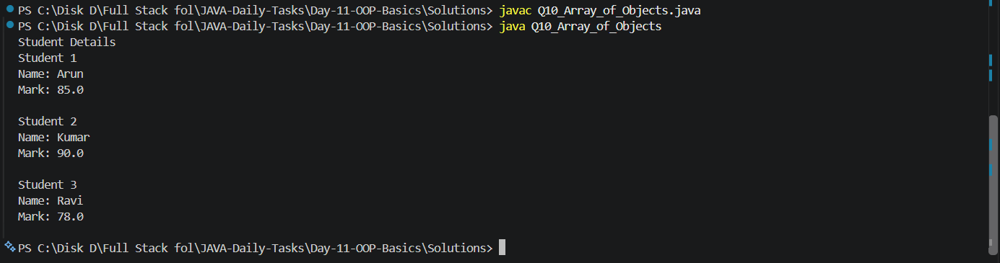

# Day 11 - OOP Basics

## 📌 Introduction

Day 11 of my **Java Daily Tasks** focuses on **OOP Basics**.

In Day 10, I learned string problem-solving concepts. In Day 11, I am learning the basic concepts of **Object-Oriented Programming (OOP)** in Java.

This day includes classes and objects, constructors, the `this` keyword, encapsulation, static members, constructor overloading, method overloading, and arrays of objects.

---

## 🎯 Objectives

The main objectives of Day 11 are:

* Understand classes and objects
* Create and use objects
* Understand constructors
* Use the `this` keyword
* Implement encapsulation
* Understand static variables and methods
* Create multiple constructors
* Practice constructor overloading
* Practice method overloading
* Work with arrays of objects
* Improve logical thinking using OOP concepts

---

## 📚 Topics Covered

* Classes
* Objects
* Constructors
* Parameterized constructors
* `this` keyword
* Encapsulation
* Private variables
* Getter and setter methods
* Static variables
* Static methods
* Constructor overloading
* Method overloading
* Arrays of objects

---

## 📁 Folder Structure

```text
Day-11-OOP-Basics/
│
├── Questions/
│   └── Questions.txt
│
├── Screenshots/
│   ├── Output_1.png
│   ├── Output_2.png
│   ├── Output_3.png
│   ├── Output_4.png
│   ├── Output_5.png
│   ├── Output_6.png
│   ├── Output_7.png
│   ├── Output_8.png
│   ├── Output_9.png
│   └── Output_10.png
│
├── Solutions/
│   ├── Q01_Student_Class.java
│   ├── Q02_Employee_Constructor.java
│   ├── Q03_Book_This_Keyword.java
│   ├── Q04_Rectangle_Class.java
│   ├── Q05_Bank_Account_Encapsulation.java
│   ├── Q06_Car_Objects.java
│   ├── Q07_Static_Counter.java
│   ├── Q08_Constructor_Overloading.java
│   ├── Q09_Method_Overloading.java
│   └── Q10_Array_of_Objects.java
│
└── README.md
```

---

## 📝 Practice Questions

### Q01 - Student Class

Create a `Student` class with student details and display the student information using an object.

### Q02 - Employee Constructor

Create an `Employee` class and use a parameterized constructor to initialize employee details.

### Q03 - Book Using This Keyword

Create a `Book` class and use the `this` keyword to initialize and display book details.

### Q04 - Rectangle Class

Create a `Rectangle` class with length and width and calculate the area of the rectangle using an object.

### Q05 - Bank Account Encapsulation

Create a `BankAccount` class using private variables and getter and setter methods to implement encapsulation.

### Q06 - Car Objects

Create a `Car` class and create multiple car objects to display their details.

### Q07 - Static Counter

Create a class with a static counter to count the number of objects created.

### Q08 - Constructor Overloading

Create a class with multiple constructors using different parameters and demonstrate constructor overloading.

### Q09 - Method Overloading

Create a class with multiple methods having the same name but different parameters and demonstrate method overloading.

### Q10 - Array of Objects

Create multiple `Student` objects and store them in an array. Display the details of all students.

---

## 💻 Solutions

| No. | Problem                    | Solution                              |
| --- | -------------------------- | ------------------------------------- |
| Q01 | Student Class              | `Q01_Student_Class.java`              |
| Q02 | Employee Constructor       | `Q02_Employee_Constructor.java`       |
| Q03 | Book This Keyword          | `Q03_Book_This_Keyword.java`          |
| Q04 | Rectangle Class            | `Q04_Rectangle_Class.java`            |
| Q05 | Bank Account Encapsulation | `Q05_Bank_Account_Encapsulation.java` |
| Q06 | Car Objects                | `Q06_Car_Objects.java`                |
| Q07 | Static Counter             | `Q07_Static_Counter.java`             |
| Q08 | Constructor Overloading    | `Q08_Constructor_Overloading.java`    |
| Q09 | Method Overloading         | `Q09_Method_Overloading.java`         |
| Q10 | Array of Objects           | `Q10_Array_of_Objects.java`           |

---

## 🖥️ Output Screenshots

### Q01 - Student Class



---

### Q02 - Employee Constructor



---

### Q03 - Book This Keyword



---

### Q04 - Rectangle Class



---

### Q05 - Bank Account Encapsulation



---

### Q06 - Car Objects



---

### Q07 - Static Counter


---

### Q08 - Constructor Overloading



---

### Q09 - Method Overloading



---

### Q10 - Array of Objects



---

## 🛠️ Technologies Used

* **Java**
* **JDK**
* **VS Code**
* **Git**
* **GitHub**

---

## ▶️ How to Run

### Step 1 - Open the Day 11 folder

```bash
cd Day-11-OOP-Basics
```

### Step 2 - Open the Solutions folder

```bash
cd Solutions
```

### Step 3 - Compile a Java program

Example:

```bash
javac Q01_Student_Class.java
```

### Step 4 - Run the program

```bash
java Q01_Student_Class
```

The same process can be followed for the remaining programs.

---

## 🧠 What I Learned

Through Day 11, I practiced:

* Creating classes
* Creating and using objects
* Initializing objects using constructors
* Using parameterized constructors
* Using the `this` keyword
* Implementing encapsulation
* Using private variables
* Creating getter and setter methods
* Understanding static members
* Counting objects using static variables
* Implementing constructor overloading
* Implementing method overloading
* Working with arrays of objects
* Improving logical thinking using OOP concepts

---

## 🎯 Learning Goal

The goal of Day 11 is to build a strong foundation in **Object-Oriented Programming** before moving toward more advanced Java topics such as:

* Inheritance
* Polymorphism
* Abstraction
* Interfaces
* Collections
* Exception Handling
* File Handling
* Data Structures
* DSA Problem Solving

---

## 📊 Progress

| Day    | Topic      | Status      |
| ------ | ---------- | ----------- |
| Day 11 | OOP Basics | ✅ Completed |

---

## 👨‍💻 Author

**M. Praveen Kumar**

* GitHub: [PraveenKumar7545](https://github.com/PraveenKumar7545)
* Repository: [JAVA-Daily-Tasks](https://github.com/PraveenKumar7545/JAVA-Daily-Tasks)

---

⭐ This is part of my **Java Daily Tasks** journey to improve my Java programming and problem-solving skills.
