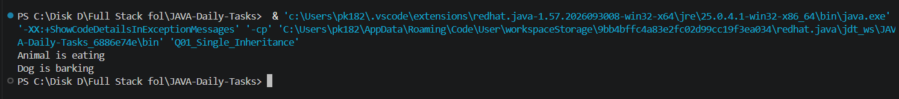
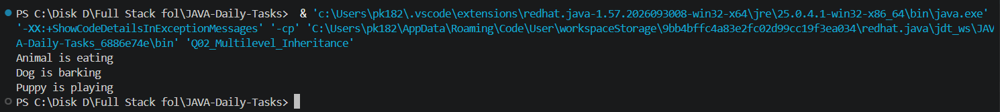
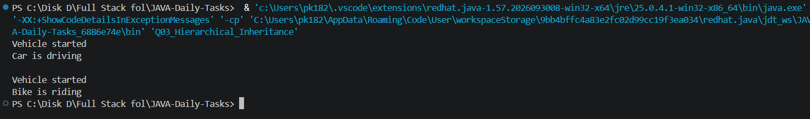
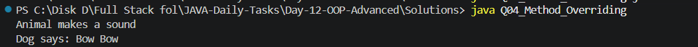
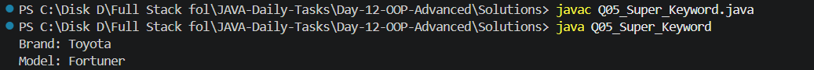
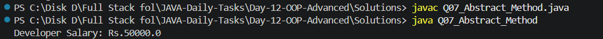
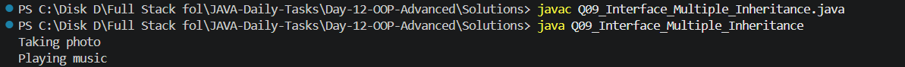
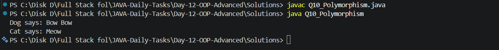

# Day 12 - OOP Advanced

## Introduction

Day 12 focuses on advanced Object-Oriented Programming concepts in Java. The practice programs cover inheritance, method overriding, the `super` keyword, abstract classes, interfaces, and polymorphism.

---

## Objectives

- Understand inheritance
- Practice different types of inheritance
- Understand method overriding
- Learn the `super` keyword
- Understand abstract classes and methods
- Learn interfaces
- Understand multiple interfaces
- Practice runtime polymorphism

---

## Topics Covered

- Single Inheritance
- Multilevel Inheritance
- Hierarchical Inheritance
- Method Overriding
- `super` Keyword
- Abstract Class
- Abstract Method
- Interface
- Multiple Interfaces
- Polymorphism

---

## Folder Structure

```text
Day-12-OOP-Advanced/
│
├── Questions/
│   └── Questions.txt
│
├── Solutions/
│   ├── Q01_Single_Inheritance.java
│   ├── Q02_Multilevel_Inheritance.java
│   ├── Q03_Hierarchical_Inheritance.java
│   ├── Q04_Method_Overriding.java
│   ├── Q05_Super_Keyword.java
│   ├── Q06_Abstract_Class.java
│   ├── Q07_Abstract_Method.java
│   ├── Q08_Interface.java
│   ├── Q09_Interface_Multiple_Inheritance.java
│   └── Q10_Polymorphism.java
│
├── Screenshots/
│   ├── Output_1.png
│   ├── Output_2.png
│   ├── Output_3.png
│   ├── Output_4.png
│   ├── Output_5.png
│   ├── Output_6.png
│   ├── Output_7.png
│   ├── Output_8.png
│   ├── Output_9.png
│   └── Output_10.png
│
└── README.md
```

---

## Practice Questions

### Q01 - Single Inheritance
Create a parent `Animal` class and a child `Dog` class using inheritance.  
**Solution:** `Q01_Single_Inheritance.java`  
**Output:**  


### Q02 - Multilevel Inheritance
Implement inheritance through `Animal`, `Dog`, and `Puppy` classes.  
**Solution:** `Q02_Multilevel_Inheritance.java`  
**Output:**  


### Q03 - Hierarchical Inheritance
Implement multiple child classes using a common parent class.  
**Solution:** `Q03_Hierarchical_Inheritance.java`  
**Output:**  


### Q04 - Method Overriding
Implement method overriding using parent and child classes.  
**Solution:** `Q04_Method_Overriding.java`  
**Output:**  


### Q05 - Super Keyword
Use the `super` keyword to access a parent class variable.  
**Solution:** `Q05_Super_Keyword.java`  
**Output:**  


### Q06 - Abstract Class
Create an abstract class and implement its abstract method.  
**Solution:** `Q06_Abstract_Class.java`  
**Output:**  


### Q07 - Abstract Method
Implement an abstract method in a child class.  
**Solution:** `Q07_Abstract_Method.java`  
**Output:**  


### Q08 - Interface
Create and implement a Java interface.  
**Solution:** `Q08_Interface.java`  
**Output:**  


### Q09 - Multiple Interfaces
Implement two interfaces in a single class.  
**Solution:** `Q09_Interface_Multiple_Inheritance.java`  
**Output:**  


### Q10 - Polymorphism
Implement runtime polymorphism using parent class references.  
**Solution:** `Q10_Polymorphism.java`  
**Output:**  


---

## How to Compile and Run

Open PowerShell and go to the Solutions folder:

```powershell
cd "C:\Disk D\Full Stack fol\JAVA-Daily-Tasks\Day-12-OOP-Advanced\Solutions"
```

Compile all Java programs:

```powershell
javac *.java
```

Run the programs individually:

```powershell
java Q01_Single_Inheritance
java Q02_Multilevel_Inheritance
java Q03_Hierarchical_Inheritance
java Q04_Method_Overriding
java Q05_Super_Keyword
java Q06_Abstract_Class
java Q07_Abstract_Method
java Q08_Interface
java Q09_Interface_Multiple_Inheritance
java Q10_Polymorphism
```

---

## Solutions

| No.  | Topic                    | Solution                              |
|------|--------------------------|---------------------------------------|
| Q01  | Single Inheritance       | `Q01_Single_Inheritance.java`         |
| Q02  | Multilevel Inheritance   | `Q02_Multilevel_Inheritance.java`     |
| Q03  | Hierarchical Inheritance | `Q03_Hierarchical_Inheritance.java`   |
| Q04  | Method Overriding        | `Q04_Method_Overriding.java`          |
| Q05  | Super Keyword            | `Q05_Super_Keyword.java`              |
| Q06  | Abstract Class           | `Q06_Abstract_Class.java`             |
| Q07  | Abstract Method          | `Q07_Abstract_Method.java`            |
| Q08  | Interface                | `Q08_Interface.java`                  |
| Q09  | Multiple Interfaces      | `Q09_Interface_Multiple_Inheritance.java` |
| Q10  | Polymorphism             | `Q10_Polymorphism.java`               |

---

## Key Learning

Through these programs, I practiced:

- Inheritance
- Method overriding
- `super` keyword
- Abstract classes
- Abstract methods
- Interfaces
- Multiple interfaces
- Runtime polymorphism
- Object-oriented design

---

## Technologies Used

- Java
- VS Code
- Git
- GitHub

---

## Progress

| Day    | Topic                      | Status     |
|--------|----------------------------|------------|
| Day 01 | Java Basics                | Completed  |
| Day 02 | Conditional Statements     | Completed  |
| Day 03 | Real-World Conditions      | Completed  |
| Day 04 | Loops                      | Completed  |
| Day 05 | Number Programs            | Completed  |
| Day 06 | Pattern Programs           | Completed  |
| Day 07 | Arrays Basics              | Completed  |
| Day 08 | Arrays Problem Solving     | Completed  |
| Day 09 | String Basics              | Completed  |
| Day 10 | Methods                    | Completed  |
| Day 11 | OOP Basics                 | Completed  |
| Day 12 | OOP Advanced               | Completed  |

---

## Learning Goal

The goal of this daily Java practice is to strengthen Java fundamentals, Object-Oriented Programming concepts, logical thinking, problem-solving skills, and technical interview preparation.

---

## Status

**Day 12 - OOP Advanced** → Completed ✅  

**Next:** Day 13 - Collections