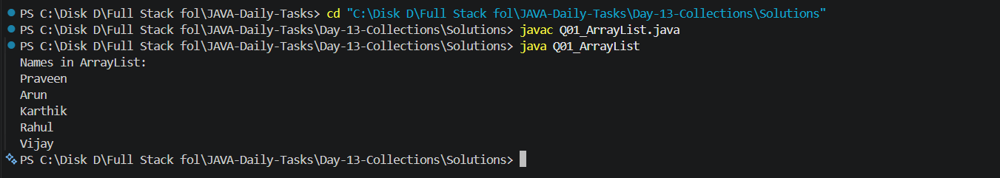
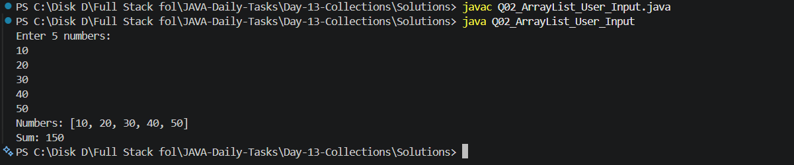
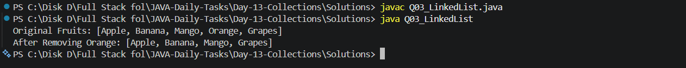
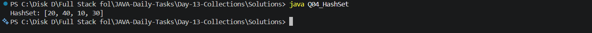
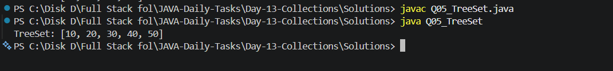
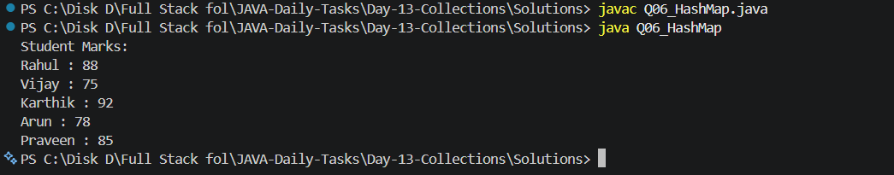
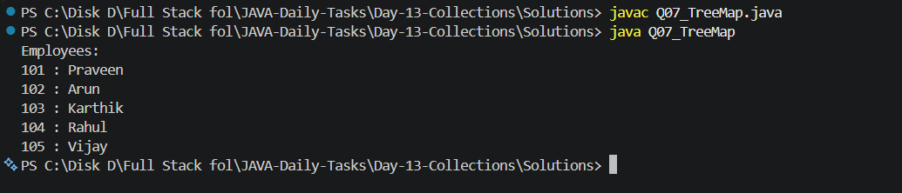
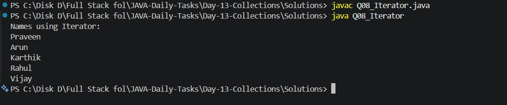
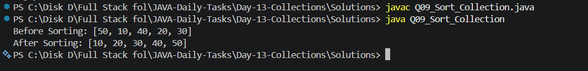
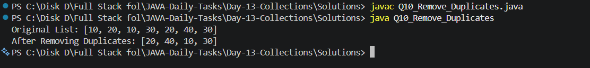

# Day 13 - Collections

## Introduction

Day 13 focuses on the **Java Collections Framework**.

The practice programs cover commonly used collection classes and concepts such as `ArrayList`, `LinkedList`, `HashSet`, `TreeSet`, `HashMap`, `TreeMap`, `Iterator`, sorting, and removing duplicate values.

---

## Objectives

- Understand the Java Collections Framework
- Learn how to use `ArrayList`
- Learn how to use `LinkedList`
- Understand `HashSet`
- Understand `TreeSet`
- Learn key-value pairs using `HashMap`
- Learn sorted key-value pairs using `TreeMap`
- Use `Iterator` to traverse collections
- Sort collection elements
- Remove duplicate values using collections

---

## Topics Covered

- ArrayList
- ArrayList with User Input
- LinkedList
- HashSet
- TreeSet
- HashMap
- TreeMap
- Iterator
- Collection Sorting
- Removing Duplicates

---

## Folder Structure

```text
Day-13-Collections/
│
├── Questions/
│   └── Questions.txt
│
├── Solutions/
│   ├── Q01_ArrayList.java
│   ├── Q02_ArrayList_User_Input.java
│   ├── Q03_LinkedList.java
│   ├── Q04_HashSet.java
│   ├── Q05_TreeSet.java
│   ├── Q06_HashMap.java
│   ├── Q07_TreeMap.java
│   ├── Q08_Iterator.java
│   ├── Q09_Sort_Collection.java
│   └── Q10_Remove_Duplicates.java
│
├── Screenshots/
│   ├── Output_1.png
│   ├── Output_2.png
│   ├── Output_3.png
│   ├── Output_4.png
│   ├── Output_5.png
│   ├── Output_6.png
│   ├── Output_7.png
│   ├── Output_8.png
│   ├── Output_9.png
│   └── Output_10.png
│
└── README.md
```

---

## Practice Questions

### Q01 - ArrayList

Create an `ArrayList` of names, add 5 names, and display all the names.

**Solution:** `Q01_ArrayList.java`

### Output



---

### Q02 - ArrayList with User Input

Get 5 numbers from the user, store them in an `ArrayList`, and calculate their sum.

**Solution:** `Q02_ArrayList_User_Input.java`

### Output



---

### Q03 - LinkedList

Create a `LinkedList` of fruits, add fruits, remove one fruit, and display the remaining fruits.

**Solution:** `Q03_LinkedList.java`

### Output



---

### Q04 - HashSet

Create a `HashSet` containing duplicate numbers and observe that duplicate values are removed.

**Solution:** `Q04_HashSet.java`

### Output



---

### Q05 - TreeSet

Create a `TreeSet` containing numbers and display them in sorted order.

**Solution:** `Q05_TreeSet.java`

### Output



---

### Q06 - HashMap

Create a `HashMap` containing student names and marks and display all key-value pairs.

**Solution:** `Q06_HashMap.java`

### Output



---

### Q07 - TreeMap

Create a `TreeMap` containing employee IDs and names and display the entries in sorted key order.

**Solution:** `Q07_TreeMap.java`

### Output



---

### Q08 - Iterator

Create an `ArrayList` of names and use `Iterator` to display each name.

**Solution:** `Q08_Iterator.java`

### Output



---

### Q09 - Sort Collection

Create an `ArrayList` of numbers and sort the numbers in ascending order.

**Solution:** `Q09_Sort_Collection.java`

### Output



---

### Q10 - Remove Duplicates

Create an `ArrayList` containing duplicate numbers and remove the duplicate values using a collection.

**Solution:** `Q10_Remove_Duplicates.java`

### Output



---

## How to Compile and Run

Open PowerShell and navigate to the `Solutions` folder:

```powershell
cd "C:\Disk D\Full Stack fol\JAVA-Daily-Tasks\Day-13-Collections\Solutions"
```

Compile all Java programs:

```powershell
javac *.java
```

Run the programs individually:

```powershell
java Q01_ArrayList
java Q02_ArrayList_User_Input
java Q03_LinkedList
java Q04_HashSet
java Q05_TreeSet
java Q06_HashMap
java Q07_TreeMap
java Q08_Iterator
java Q09_Sort_Collection
java Q10_Remove_Duplicates
```

---

## Solutions

| No. | Topic | Solution |
|---|---|---|
| Q01 | ArrayList | `Q01_ArrayList.java` |
| Q02 | ArrayList with User Input | `Q02_ArrayList_User_Input.java` |
| Q03 | LinkedList | `Q03_LinkedList.java` |
| Q04 | HashSet | `Q04_HashSet.java` |
| Q05 | TreeSet | `Q05_TreeSet.java` |
| Q06 | HashMap | `Q06_HashMap.java` |
| Q07 | TreeMap | `Q07_TreeMap.java` |
| Q08 | Iterator | `Q08_Iterator.java` |
| Q09 | Sort Collection | `Q09_Sort_Collection.java` |
| Q10 | Remove Duplicates | `Q10_Remove_Duplicates.java` |

---

## Key Learning

Through these programs, I practiced:

- Creating and managing collections
- Adding and removing elements
- Using `ArrayList`
- Using `LinkedList`
- Removing duplicates with `HashSet`
- Sorting elements using `TreeSet`
- Storing key-value pairs using `HashMap`
- Sorting keys using `TreeMap`
- Traversing collections using `Iterator`
- Sorting collections using `Collections.sort()`

---

## Technologies Used

- Java
- VS Code
- Git
- GitHub

---

## Progress

| Day | Topic | Status |
|---|---|---|
| Day 01 | Java Basics | Completed |
| Day 02 | Conditional Statements | Completed |
| Day 03 | Real-World Conditions | Completed |
| Day 04 | Loops | Completed |
| Day 05 | Number Programs | Completed |
| Day 06 | Pattern Programs | Completed |
| Day 07 | Arrays Basics | Completed |
| Day 08 | Arrays Problem Solving | Completed |
| Day 09 | String Basics | Completed |
| Day 10 | Methods | Completed |
| Day 11 | OOP Basics | Completed |
| Day 12 | OOP Advanced | Completed |
| Day 13 | Collections | Completed |

---

## Learning Goal

The goal of this daily Java practice is to strengthen Java fundamentals, Object-Oriented Programming concepts, Collections, logical thinking, problem-solving skills, and technical interview preparation.

---

## Status

**Day 13 - Collections Completed ✅**

**Next:** Day 14 - Exception & File Handling